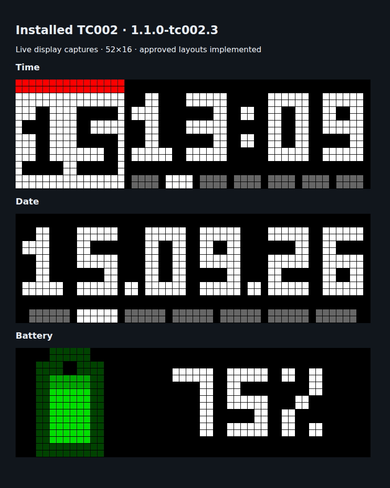

# AWTRIX NG TC002

An unofficial native Linux/ARMv7 port of **AWTRIX NG 1.1.0** for the TC002's
**52 × 16** pixel matrix. It runs the upstream core, renderer, Berry scripting,
HTTP API, MQTT dispatcher and web UI directly on the clock.

## Thank you, Blueforcer ❤️

This port exists thanks to **[Blueforcer (Stephan Mühl)](https://github.com/Blueforcer)**,
the author of **[AWTRIX NG](https://blueforcer.github.io/awtrix-ng/)**.
The firmware core, MQTT interface, scripting engine and web UI build on his work
and the contributions of the AWTRIX community. Huge thanks for making AWTRIX NG
available to study, adapt and enjoy on more hardware!

Explore the [original project](https://github.com/Blueforcer/awtrix-ng), read the
[AWTRIX NG documentation](https://blueforcer.github.io/awtrix-ng/), and give
Blueforcer a star if you enjoy this port. This is an independent, unofficial TC002
adaptation, maintained here; it is not an official Blueforcer or Ulanzi release.



## MQTT compatibility

The MQTT interface uses the exact upstream topic paths and payload handling:
[AWTRIX NG MQTT reference](https://blueforcer.github.io/awtrix-ng/reference/mqtt/).
No TC002 topic prefix or translation service is added. The default prefix is the
clock's 12-character MAC; it can be changed in System → MQTT.

## Current status

This **release candidate was installed and verified after a Linux reboot** on the
test clock on 2026-09-15. AWTRIX starts automatically from flash, serves the web UI
on port 80 and stores settings in `/data/awtrix-ng`. See [WORKLOG.md](WORKLOG.md)
for measured results and outstanding physical checks.

Confirmed on TC002 stock app 1.1.1 / MCU V1.0.17:

- Correct, steady 52 × 16 RGB output using the full app; about 42 FPS.
- Speaker playback of two sets of three rising notes, confirmed by the owner.
- MP3 file playback and local HTTP MP3 streaming, checked at zero volume.
- Battery percentage from the MCU and live Wi-Fi status/scanning.
- Left/right buttons, rotary navigation, mDNS discovery and NTP synchronization.
- Certificate-verified HTTPS with the bundled OpenSSL 3.5.8 implementation.
- Upstream dashboard with a 520 × 160 preview, checked in a real browser.
- All 21 MQTT/platform integration checks, including replies, retained state,
  Home Assistant discovery and silent rejection of unknown topics.
- Temporary vendor launcher replacement starts AWTRIX successfully and restores
  stock afterward.

Implemented platform services include Wi-Fi configuration, DHCP/static addressing,
NTP/timezone, mDNS announcements, Art-Net, buttons/rotary input, speaker RTTTL/MP3,
HTTP(S) MP3 radio, playlists, configuration persistence and a res-only update helper.
Services marked as unverified in WORKLOG.md need a physical check before relying
on them unattended.

Hardware differences: the TC002 has fixed wiring and no light, temperature or
humidity sensor; those GPIO controls are hidden. Brightness remains adjustable.
Sleep blanks the panel and pauses services for the requested duration; it does
**not** enter ESP32-style deep sleep. Reboot restarts AWTRIX's process. Linux,
the bootloader and MCU firmware are preserved.

## Display sizing (1.1.0-tc002.3)

- The approved clock, date and battery layouts render directly at 52 × 16 with
  uniform 2 × 2 font pixels and fixed, balanced spacing.
- Clock/calendar: a 16 × 16 tile with two header rows, centred day at baseline 14,
  time starting at column 17, and seven 4 × 2 weekday markers starting at column
  17 with one-pixel gaps. The marker colours, week start and separator animation
  follow the existing settings.
- Numeric date (`DD.MM.YY`): 50-pixel text width with equal one-pixel side margins,
  equal 2 × 2 dots, and seven 6 × 2 weekday markers with equal outer margins.
- Battery: a symmetric 10 × 16 icon centred in a 16-column area; percentage text
  centres in the remaining 34-column area at every value, including 0% and 100%.
  Charge colours, fractional fill and the low-battery colour override are retained.
- Alternate clock modes (big/binary), date formats too wide for the native layout,
  and sensor layouts retain the previous fitted rendering. Wider source layouts
  expand before fitting to avoid edge cropping.
- Pushed apps and notifications use fonts at twice their original size, including
  matching text measurement, centring and scrolling. Effects, transitions, charts
  and overlays render on the physical 52 × 16 canvas.
- Existing 8 × 8 page icons automatically display at 16 × 16. Classic 32 × 8
  backgrounds fit to 52 × 16. Native GIF/JPEG assets up to 52 × 16 retain their
  source pixels; the web UI converts PNG uploads to GIF. Animated GIFs support
  the same sizes. Text reserves the actual icon width plus a two-pixel gap.
- The icon editor starts at 16 × 16 and offers 52 × 16, 8 × 8 and 32 × 8 presets.
  Its live still-frame preview uses the same scaling as saved icons.
- Explicit MQTT/HTTP `draw` coordinates and Berry drawing/text coordinates remain
  physical pixels: `(51,15)` is the bottom-right LED. Berry `icon()` now supports
  native assets through 52 × 16; it draws their original dimensions, so scripts
  can position multiple icons precisely. Existing scripts with hardcoded 32 × 8
  layouts need their coordinates updated; use `width()` and `height()`.
- The live web preview has the correct 52:16 aspect ratio. Progress bars and
  status indicators are two pixels thick; dense bar charts retain their final
  sample and fill the available width.

## Build on Linux x86-64

Install `uv`, a C/C++ build environment, Perl, curl, tar, and `squashfs-tools`.
Python tooling always runs through uv.

```sh
git clone https://github.com/sanderdw/awtrix-ng-tc002.git
cd awtrix-ng-tc002
bash tools/build.sh
```

The script downloads SHA-256-pinned Arm GNU 9.2-2019.12 and OpenSSL 3.5.8,
uses `uv sync --locked`, cross-compiles, and writes stripped binaries into
`dist/bin/`. It does not contact or flash a clock.

Existing build dependencies can be reused:

```sh
TC002_TOOLCHAIN=/path/to/gcc9 TC002_TLS=/path/to/openssl-build bash tools/build.sh
```

## Try from RAM first

Use Google Android platform-tools ADB. The TC002's old ADB implementation does
not support `adb reverse`. Port 5555 must be reachable on your local network.

```sh
ADB=/path/to/platform-tools/adb uv run tools/trial.py CLOCK_IP \
  --binary dist/bin/awtrix-tc002 --seconds 180 --tone
```

Replace `CLOCK_IP` with your clock's address and open `http://CLOCK_IP:18081`
during the trial. The script temporarily stops the `zkswe` launcher service,
uses an isolated `/tmp` data directory, and restarts the installed service when
AWTRIX exits (stock on an unmodified clock, AWTRIX after installation).
The trial expires on the device even if the host test
client disconnects. It does not modify `/res` or permanent AWTRIX configuration.
A power cycle starts the firmware currently installed in flash.

## Build update and recovery images

Keep a backup of your own clock's live `/res` partition and a valid stock TC002
ZKSWE `update.img`. The latter supplies the device's container metadata; recovery
is generated from the **live backup**, not from an older stock update.
Store your inputs locally in the ignored `device-private/` directory. Vendor
firmware, device backups and ready-made update/recovery images are not distributed
in this repository. Build images from your own clock's backup.

```sh
uv run tools/image.py --stock device-private/stock-update.img \
  --live-res device-private/live-res.bin --build dist/bin --output dist
```

Outputs:

- `dist/update.img`: AWTRIX plus the original vendor bootstrap in the res partition.
- `dist/restore-stock.img`: the original live res filesystem.
- `dist/manifest.json`: lengths, SHA-256 checksums and upstream revision.

The packer checks the TC002 platform header, CRC, payload MD5, filesystem bounds
and 8 MiB res partition limit. It preserves the stock compressor and block size.
The native updater independently validates the container and checks the live
NOR flash layout before erasing. It writes and reads back one erase block at a
time. Neither tool writes other flash partitions.

### Installation and recovery

Permanent installation and automatic startup after reboot have passed on the test
clock. Keep stable USB power and the recovery image available on the host.
The helper stops the GUI and its Bluetooth helper before unmounting `/res`;
if unmounting fails, it aborts before erasing and restarts the GUI.

The built helper accepts:

```sh
# Validation only; available on host and clock.
build-host/tc002-update --validate dist/update.img
# On the clock, additionally check its partition geometry without writing:
/tmp/awtrix-update-helper --preflight /tmp/awtrix-update.img
```

For installation, copy `dist/bin/tc002-update` to `/tmp/awtrix-update-helper` and
the selected image to `/tmp/awtrix-update.img`, then execute on the clock:

```sh
chmod 700 /tmp/awtrix-update-helper
/tmp/awtrix-update-helper --install /tmp/awtrix-update.img
```

**`--install` writes flash and reboots.** Use `restore-stock.img` with the same
helper to restore stock. If a write fails and ADB remains available, keep
power on and inspect the error before retrying. Do not interrupt power during a
write. If ADB is unavailable after a failed boot, recovery needs the stock
bootloader's update path or a serial connection; this has not been validated.

After installation the normal web UI is at the clock's address on the configured
port (default 80). System → Maintenance accepts TC002 `.img` updates, uses the
same validator/helper and logs the update at `/tmp/awtrix-update.log`.
The update helper is about 14 KiB and uploads are streamed to keep RAM use bounded.
Assets and configuration live in `/data/awtrix-ng` and survive res updates.
Restoring stock leaves that AWTRIX data directory intact.

## MQTT example

Enable MQTT and set the broker in the web UI. With prefix `awtrixNG`:

```sh
mosquitto_pub -h BROKER -t 'awtrixNG/cmd/notify' \
  -m '{"text":"Hello TC002","durationMs":5000}'
mosquitto_sub -h BROKER -t 'awtrixNG/cmd/notify/result'
mosquitto_pub -h BROKER -t 'awtrixNG/cmd/screen/get' -m ''
```

The screen reply is `awtrixNG/state/screen`, with width 52, height 16 and 832
pixels. See the upstream reference for the complete topic list.

## Development checks

A host build requires OpenSSL development headers:

```sh
uv run cmake -S . -B build-host -G Ninja -DCMAKE_BUILD_TYPE=Release
uv run cmake --build build-host -j4
uv run ctest --test-dir build-host --output-on-failure
uv run pytest -q
```

For MQTT tests against the actual ARM binary, compile `tools/mqtt_test_relay.c`
with the cross compiler, then:

```sh
ADB=/path/to/adb AWTRIX_DEVICE_SERIAL=CLOCK_IP:5555 \
AWTRIX_TEST_RELAY=/path/to/arm-relay AWTRIX_TEST_BINARY=dist/bin/awtrix-tc002 \
uv run pytest -q tests/test_integration.py
```

The relay is confined to loopback on the clock and uses ADB forwarding to a
local broker. Tests restart the installed launcher service on exit. Do not run
two physical trials at once.

## Contributing

Bug reports and improvements for the TC002 port are welcome in
[this repository](https://github.com/sanderdw/awtrix-ng-tc002/issues).
See [CONTRIBUTING.md](CONTRIBUTING.md) for the source layout and validation steps.

## License

Published under **PolyForm Noncommercial 1.0.0**, following upstream AWTRIX NG.
This is **source-available**, with noncommercial terms, rather than OSI-approved
open-source software. Upstream copyright and third-party licenses are retained. See
[LICENSE.md](LICENSE.md) and [THIRD-PARTY-NOTICES.md](THIRD-PARTY-NOTICES.md).
